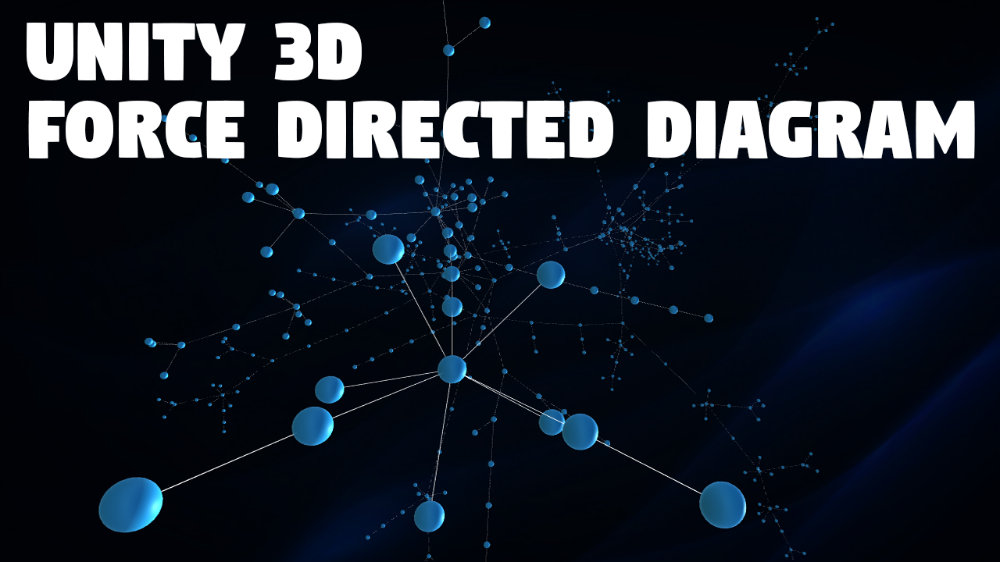

<h3 align="center">Force Directed Diagram</h3>

## Overview

This package provides components and tools to display link/node data in the form of a Force Directed graph drawing.  

This type of layout is commonly used in a variety of application areas: network visualization, large graph visualization, knowledge representation, system management, or mesh visualization.  

It is used to visualize the connections between objects in a network. By grouping the objects connected to each other in a natural way, a Force-Directed Graph is visually interesting and also makes it possible to discover subtle relationships between groups.  

The current implemented features are : 
- Drag and drop
- Fixed nodes
- Camera focus on specific node
- Physics parameters real-time tweaking
- Image nodes
- Text nodes
- Grouping nodes by data values
- Full node and link customization with node and link factories
- Diagram editor
- Export/import as json
- GPU computed diagram layout (over 5000 nodes and links at over 30 fps)
- 2D support with pan and zoom
- Business cases for trading data visualization, fault detection, isolation and recovery, and organization management

See [the demo video for a few examples of what can be achieved with this package.](https://www.youtube.com/watch?v=hWt5WPO8c6A&t=52s)  

The [Diagram editor can be downloaded here.](https://drive.google.com/file/d/1LljhMxs2by2Mnaiq8FIg0Up_JWUEs8Lu/view?usp=sharing) 

## Package contents

- Editor
- ForceDirectedDiagram
    - ComputeShader
    - Examples
    - Resources
        - Diagrams
        - Images
        - Material
        - Models
        - PostProcess
        - Prefab
    - Scripts
        - ForceDirectedDiagram
        - Helpers
    - StandaloneFileBrowser

## Installation instructions

[Install a package from a registry](https://docs.unity3d.com/Manual/upm-ui-install.html)

## Render pipeline compatibility

The Built-in Render Pipeline is Unity’s default render pipeline. It is a general-purpose render pipeline that has limited options for customization. The Universal Render Pipeline (URP) is a Scriptable Render Pipeline that is quick and easy to customize, and lets you create optimized graphics across a wide range of platforms. The High Definition Render Pipeline (HDRP) is a Scriptable Render Pipeline that lets you create cutting-edge, high-fidelity graphics on high-end platforms.

| Unity Version              | Built-in | URP | HDRP |
| :----------------- | :------ | :------ | :------ |
Unity 2021.3.2f1 and later | Compatible | Compatible | Compatible

## Workflows

To start working with force diagram layouts, you may start from one of the sample scenes included in the package. 

To add a force directed diagram layout to your scene from scratch, please follow the following steps :

1) Create an empty gameobject which will be the container for your nodes and links

2) Add a **Force Directed Diagram Manager** component

3) Add one of the node factories component. Each factory will display the nodes differently, according to your requirements. The available node factories are :
    - Billboard Group Node Factory
    - Color and Shape Node Factory
    - Color Node Factory
    - Color, Text and Shape Node Factory
    - Custom Node Factory
    - Fixed Node Factory
    - Simple Node Factory  
    - ... You can also implement your own node factory.

4) Add one of the link factories component. Each factory will display the links differently, according to your requirements. The available link factories are :
    - Color Link Factory
    - Custom Link Factory
    - Gradient Link Factory
    - Text Link Factory
    - ... You can also implement your own link factory.

5) Fill in the factories with the required prefabs and parameters.

6) Fill in the Force Directed Diagram Manager with the desired parameters.

7) Import your .json link/node data

8) The Force Directed graph layout is ready. Run your scene.

You're done !

© Forgin Bits 2023